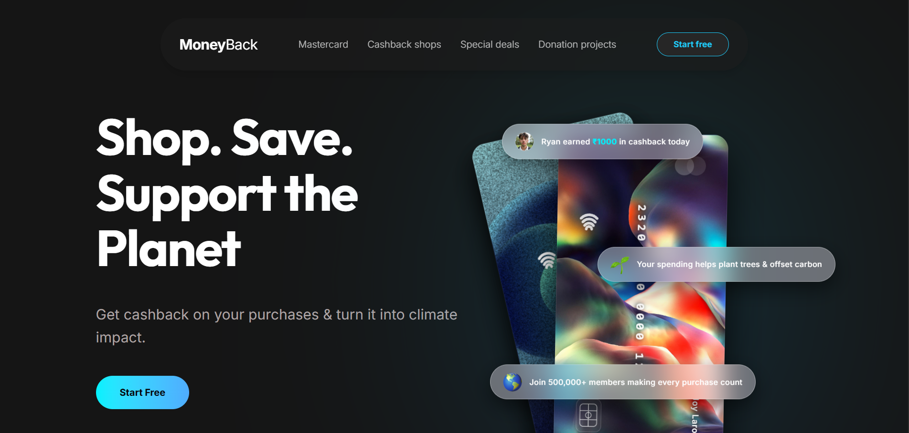
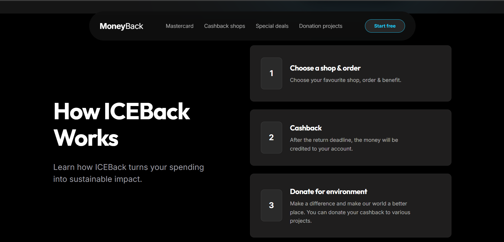
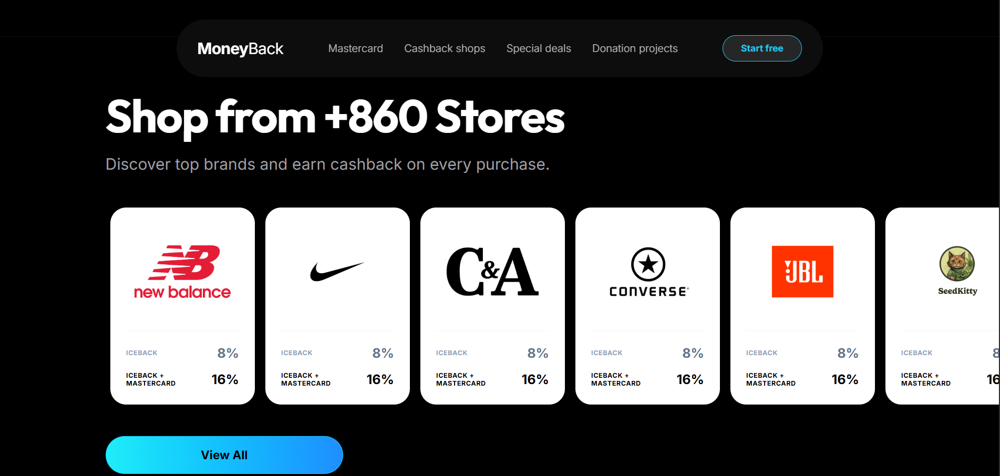
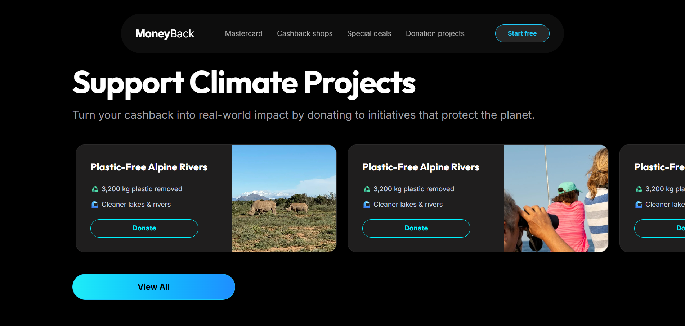

# Iceback


Iceback is a modern FinTech & Climate Action platform turning everyday online shopping cashback into tangible environmental impact. Designed for conscious consumers who want to earn rewards while supporting verified climate projects, it offers an intuitive environment to shop top brands, earn up to 2x cashback with the Iceback Mastercard, and direct savings toward polar bear habitat preservation and ocean cleanup.

## Key Features

- **Integrated Brand Cashback:** Earn cashback from top partner stores including Nike, JBL, New Balance, C&A, and Converse.
- **Prepaid Iceback Mastercard:** Seamlessly double your cashback rewards with zero annual fees and direct payout options.
- **Transparent Climate Impact:** Donate cashback to verified environmental projects protecting polar bear habitats and oceans.
- **Micro-Animations & Transitions:**
  * Silky touch-drag horizontal scroll carousels with custom momentum friction physics.
  * Smooth-scrolling anchor navigation and dynamic glassmorphism UI cards.
  * Responsive 1:1 Figma design layout customized for Mobile, Tablet, and Desktop screens.
- **Robust Tech Stack:** Built on Next.js 16 (App Router + Turbopack), TypeScript, and Tailwind CSS.

---

## Screenshots

| Public Landing Page | How It Works |
| :---: | :---: |
|  |  |
| *Modern responsive landing page & floating header* | *3-step platform guide & cashback process* |

| Partner Brands & Vouchers | Climate Impact & Projects |
| :---: | :---: |
|  |  |
| *Partner store deals & voucher sliders* | *Verified environmental projects & donation cards* |

---

## Tech Stack

**Frontend:**
- **Language:** TypeScript & JavaScript
- **Framework:** Next.js 16 (App Router)
- **Styling:** Tailwind CSS & Vanilla CSS
- **Transitions:** Custom Momentum Physics & CSS Keyframes
- **Icons:** Lucide React

**Deployment:**
- **Hosting:** Vercel

---

## Getting Started

### Prerequisites
- Node.js (v18+)

### 1. Clone & Install
Install the project dependencies in the root directory:

```bash
git clone https://github.com/aditya-sonkar/iceback.git
cd iceback
npm install
```

### 2. Run the Development Server
Start the local Next.js development server:

```bash
npm run dev
```

Visit `http://localhost:3000` to view the Iceback app!

### 3. Build for Production
To build and optimize the application for production locally:

```bash
npm run build
```

---

## License
This project is licensed under the MIT License.
